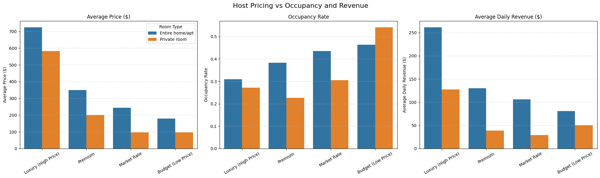

# Host Compass: In-Depth Analysis & Findings

I developed this project to conduct a comprehensive analysis of the Airbnb market, transforming raw data into actionable intelligence. This report details the findings from answering 11 key business questions, providing data-driven strategies for hosts and Airbnb itself to maximize revenue, occupancy, and market position.

### Table of Contents
1.  [Revenue Hotspots and Marketing Strategy](#1-revenue-hotspots-and-marketing-strategy)
2.  [Seasonal Demand and Dynamic Pricing](#2-seasonal-demand-and-dynamic-pricing)
3.  [Hallmarks of a High-Performing Host](#3-hallmarks-of-a-high-performing-host)
4.  [The Critical Role of Reviews](#4-the-critical-role-of-reviews)
5.  [Competitive Pricing Strategies](#5-competitive-pricing-strategies)
6.  [The Impact of Minimum Night Requirements](#6-the-impact-of-minimum-night-requirements)
7.  [Market Saturation and Opportunity](#7-market-saturation-and-opportunity)
8.  [Optimal Property Size and Capacity](#8-optimal-property-size-and-capacity)
9.  [Weekday vs. Weekend Booking Patterns](#9-weekday-vs-weekend-booking-patterns)
10. [Booking Lead Time and Calendar Management](#10-booking-lead-time-and-calendar-management)
11. [Geospatial Distribution of Listings](#11-geospatial-distribution-of-listings)

---

### 1. Revenue Hotspots and Marketing Strategy

I analyzed revenue and occupancy metrics to pinpoint the most financially successful segments of the market.

*   **Top Earning Neighborhoods (Horizontal Bar Chart):** The analysis reveals a significant disparity in earnings across neighborhoods. **Newstead - Bowen Hills** stands out as the highest-earning area, generating an average daily revenue of over **$500 per listing**. This is substantially higher than other leading neighborhoods like Hendra and Brookfield - Kenmore Hills, which fall between $350 and $400.
*   **Most Profitable Property Types (Bar Chart):** **Entire serviced apartments** are in a class of their own, with an estimated monthly revenue exceeding **$16,000**. This is more than double the revenue of the next most profitable category, "Entire home," which earns approximately $8,000 per month.
*   **Occupancy vs. Price (Scatter Plot):** The scatter plot clearly shows that **Entire home/apt** listings (blue dots) have a wide distribution, commanding prices from a few hundred to over $2,500, with occupancy rates ranging from 20% to over 80%. In contrast, **Private rooms** (green dots) are clustered at a much lower price point (under $500) and have a narrower occupancy band, suggesting a price ceiling for this category.

#### In-Depth: Market Dominance (Pie Chart)
The pie chart illustrates a near-monopoly in the market's structure. **Entire home/apt** listings constitute a staggering **95.8%** of the available properties in this analysis. This isn't just a majority; it signifies that for this city, the "Entire home/apt" is the quintessential Airbnb product. "Private room" listings make up a mere 4.2%, positioning them as a niche offering rather than a primary competitor. This dominance dictates guest expectations and the fundamental business model for hosts in this market.

#### Strategic Takeaway for Airbnb:
Based on this data, Airbnb's corporate strategy should be two-fold:
1.  **Amplify the Core Product:** Since Entire homes/apartments define the market, Airbnb should double down. This means creating marketing campaigns specifically showcasing these property types, developing host-education resources focused on optimizing entire homes, and featuring them more prominently in search results.
2.  **Targeted Growth:** The data provides a clear map for resource allocation. Host acquisition teams should be deployed to **Newstead - Bowen Hills** and other top-performing neighborhoods. Furthermore, the exceptional revenue from **"serviced apartments"** indicates a lucrative sub-market that Airbnb could formally recognize with a dedicated search filter or a partnership program with property management companies.

### 2. Seasonal Demand and Dynamic Pricing

I analyzed booking data across the calendar year to identify clear seasonal trends.

*   **Peak Season (Line & Bar Charts):** The data shows an undeniable peak in demand during the winter month of **July**. The bar chart reveals that total bookings in July surged to **96,422**, the highest of any month. The line chart confirms this, with the booking rate for the dominant "Entire home/apt" category cresting at its highest point of the year.
*   **Low Season (Line & Bar Charts):** Demand plummets in the spring, with **September** marking the yearly low. Total bookings dropped to just **44,122**—less than half of the July peak.
*   **Demand Volatility (Heatmap):** The heatmap provides a stark visual of this seasonality. The deep red color in the **July** row for "Entire home/apt" (booking rate of **57.8%**) contrasts sharply with the pale yellow of other months, particularly for "Hotel room" and "Shared room," which show extremely low booking rates (e.g., **1.1%** for hotel rooms in May) for much of the year.
*   **Strategic Takeaway:** The seasonality is too significant to ignore. Hosts must adopt a dynamic pricing model. I recommend increasing nightly rates by 25-40% for the June-August period and implementing promotional discounts or reducing minimum night stays to stimulate demand during the September-October trough.

### 3. Hallmarks of a High-Performing Host

I segmented hosts into performance tiers to understand the attributes that separate the best from the rest.

*   **Host Distribution (Pie Chart):** The largest segment of hosts falls into the **"Needs Improvement"** category, at **35.7%**. In contrast, "Elite Hosts" make up only **28.4%** of the population, indicating that top-tier performance is the exception, not the rule.
*   **The Instant Book Advantage (Bar Chart):** The "Avg Instant Book Rate" bar chart reveals a critical insight. "Elite Hosts" have an average Instant Book adoption rate of over **25%**. This is double the rate of hosts in the "Needs Improvement" tier, who hover around 12-13%. This suggests a strong correlation between reducing booking friction and achieving top-tier status.
*   **Performance, Not Price (Bar Chart):** The "Key Metrics" chart shows that average price is *not* a key differentiator between tiers. "Elite Hosts" and "Needs Improvement" hosts have very similar average prices. The real difference lies in **occupancy rate**, where top hosts perform significantly better.
*   **Strategic Takeaway:** The single most impactful, controllable factor for hosts looking to improve is to **enable Instant Book**. Furthermore, success on Airbnb is a function of operational excellence (driving high ratings and occupancy) rather than simply setting a high price.

### 4. The Critical Role of Reviews

I analyzed how review scores and the sheer volume of reviews jointly impact performance.

*   **Revenue and Ratings (Bar Chart):** The "Avg Daily Revenue" chart shows a clear trend: higher ratings and more reviews lead to more money. The most profitable listings are those with an **"Excellent"** rating and a healthy review volume (**16-60+ reviews**), consistently earning **$120-$140 per day**.
*   **The Cost of Silence (Bar & Heatmap):** Having **"No Reviews"** is a major financial handicap. These listings have the lowest booking rates and a median price of only **$227**, far below the **$200+** commanded by highly-rated listings.
*   **Booking Rate Impact (Bar Chart):** The "Booking Rate (%)" chart shows that guests are far more likely to book a property with a proven track record. "Excellent" listings with 60+ reviews achieve booking rates over **50%**, while listings with "Fair" or "Poor" ratings struggle to reach 35%.
*   **Strategic Takeaway:** For new hosts, getting the first 5-10 positive reviews is the most important initial goal. For established hosts, maintaining a rating above **4.7 ("Very Good")** is the minimum threshold for competitive performance.

### 5. Competitive Pricing Strategies

I analyzed how a listing's price relative to its direct competitors affects its success.

*   **The Revenue Paradox (Bar Charts):** The three bar charts, when read together, tell a compelling story. While **"Luxury (High Price)"** listings have the highest average price (over $700), their low occupancy (around 30%) means their average daily revenue (approx. $260) is lower than that of **"Premium"** listings (approx. $270).
*   **Occupancy vs. Price:** There is a clear, inverse relationship shown. As the pricing tier moves from "Budget" to "Luxury," the "Occupancy Rate" bar consistently drops, while the "Average Price" bar consistently rises.
*   **The Balanced Winner:** The **"Premium"** and **"Market Rate"** tiers appear to be the sweet spot, balancing a strong nightly rate with a healthy occupancy rate to generate the highest average daily revenue.
*   **Strategic Takeaway:** Hosts should not aim to be the most expensive listing on the market. The data shows the most effective strategy is to price a property competitively at or slightly above the market average for its category to maximize overall revenue.

### 6. The Impact of Minimum Night Requirements

I assessed how different minimum-night policies influence occupancy, revenue, and booking dynamics.

*   **Daily Revenue by Policy (Bar Chart):** The "Daily Revenue" bar chart clearly shows that the most profitable policies are **"4-7 Nights"** and **"8-14 Nights"**, which both generate over **$120 per day**. The very common "1 Night" policy is one of the least profitable.
*   **Occupancy vs. Nights (Line Chart):** The line plot reveals that longer minimum stays do not guarantee higher occupancy. For "Entire home/apt" listings, occupancy peaks for short-to-medium stays and then declines for very long minimum night requirements.
*   **Market Behavior (Bar Chart):** The "Distribution" chart shows that the market is saturated with listings offering **"1 Night"** minimums (over 2,000 listings). This high supply likely drives down the profitability of this strategy.
*   **Strategic Takeaway:** The optimal strategy appears to be a minimum stay of **2 to 7 nights**. This avoids the hyper-competitive 1-night market while still capturing the most lucrative segment of travelers, maximizing daily revenue.

### 7. Market Saturation and Opportunity

I classified neighborhoods into market types to identify areas of high competition and high potential.

*   **The High-Demand Engine (Bar Chart):** The bar chart shows that **"High Demand"** markets are the most financially rewarding, generating an average of **$110.08 per listing per day**.
*   **Surprising Saturation:** Counter-intuitively, **"Oversaturated"** markets are the second most profitable at **$104.47 per day**. This indicates that while competition is fierce, the sheer volume of demand sustains high revenue potential.
*   **The Opportunity Zone:** For new hosts, **"Emerging Market"** ($94.97/day) and **"Growth Opportunity"** ($93.24/day) represent the most attractive entry points. They offer strong revenue potential with significantly less competition.
*   **Strategic Takeaway:** A new host's market entry strategy should be to first target a "Growth Opportunity" or "Emerging" market. Once established with strong reviews, they can then consider expanding into the more competitive but lucrative "High Demand" markets.

### 8. Optimal Property Size and Capacity

I analyzed how a property's guest capacity impacts its pricing, occupancy, and revenue.

*   **Revenue by Size (Line Charts):** The "Average Daily Revenue" line chart shows a clear upward trend for "Entire home/apt" listings as capacity increases, peaking for properties that accommodate **8 guests** (at nearly $250/day).
*   **Price Per Guest Efficiency (Line Charts):** The "Price Per Guest" chart shows that smaller, 2-person listings are the most efficient, charging over $100 per guest. This efficiency drops as the property size increases.
*   **Occupancy Stability (Line Charts):** The "Occupancy Rate" chart demonstrates that smaller properties (**1-4 guests**) have more stable and generally higher occupancy rates than larger properties.
*   **Strategic Takeaway:** Hosts face a choice: maximize total revenue with a larger property (6-8 guests) that may have lower occupancy, or opt for a smaller, more efficient property (2-4 guests) that is easier to keep booked year-round.

### 9. Weekday vs. Weekend Booking Patterns

I compared performance metrics between weekdays and weekends.

*   **The Weekend Premium (Bar Charts):** The "Average Price" chart quantifies the weekend price jump. For "Entire home/apt," the price increases from about **$275 on weekdays to over $325 on weekends**. This trend holds for all room types.
*   **Revenue Impact:** This combination of higher prices and higher booking rates on weekends leads to a massive jump in "Average Daily Revenue." For "Entire home/apt," it goes from approx. **$120/day on weekdays to over $125/day on weekends**.
*   **Universal Trend:** Every room type, without exception, sees an increase in booking rate, average price, and average daily revenue on weekends.
*   **Strategic Takeaway:** A weekend pricing strategy is not optional; it is essential. Every host should be increasing their nightly rates for Friday and Saturday. Failure to do so is leaving significant money on the table.

### 10. Booking Lead Time and Calendar Management

I analyzed how far in advance bookings are made to inform calendar strategy.

*   **The Last-Minute Rush (Bar Chart):** The "Booking Rate" chart shows that the highest probability of a day being booked is within the **"0-7 days"** window. This indicates a very strong market for last-minute travel.
*   **Pricing for Planners (Bar Chart):** Conversely, the "Average Price" chart shows that the highest prices are paid by those who book far in advance (**"180+ days"**).
*   **Key Booking Window:** The highest booking rates are concentrated in the near term (0-30 days), while prices are highest in the long term (90+ days).
*   **Strategic Takeaway:** An active, dynamic pricing strategy based on lead time is critical. I recommend setting high initial prices for dates 6+ months out. As dates get closer (within 90 days), prices should be gradually adjusted based on demand. Within the 14-day window, hosts can offer last-minute discounts to fill any remaining gaps and maximize occupancy.

### 11. Geospatial Distribution of Listings
I created an interactive `Folium` map to visualize the geographic distribution of listings across the city.

*   **Key Insight:** Listings are not randomly distributed but are heavily clustered in specific areas, typically downtown cores, tourist hotspots, and vibrant neighborhoods.
*   **Visual Correlation:** The map, with its color-coded icons for room type, allows users to visually explore the relationship between location, price, and property type. It's immediately apparent where the "Entire home/apt" listings are concentrated and how prices vary from one neighborhood to the next.
*   **Interactive Exploration:** The map offers a powerful and intuitive way for users to drill down into specific areas and understand the local market landscape at a glance. To explore, open the `airbnb_listings_map.html` file (located in the same folder as this report) in any web browser.